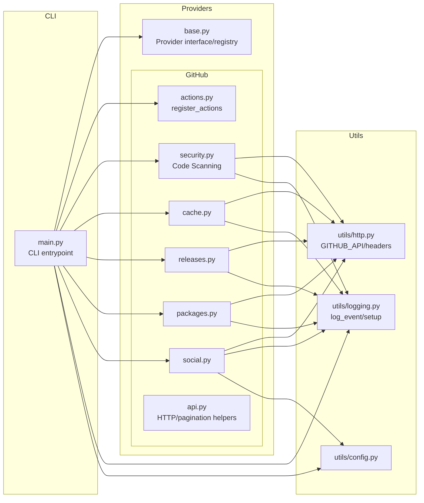
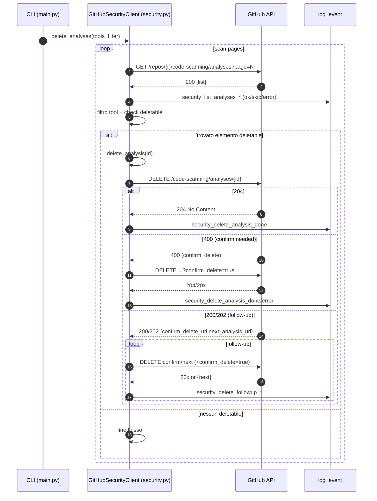
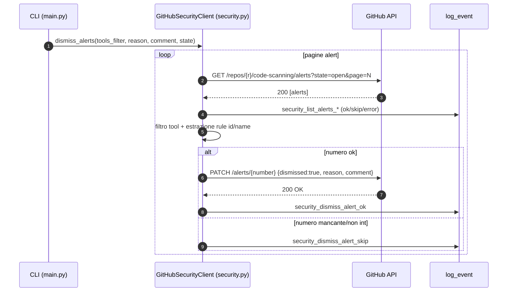
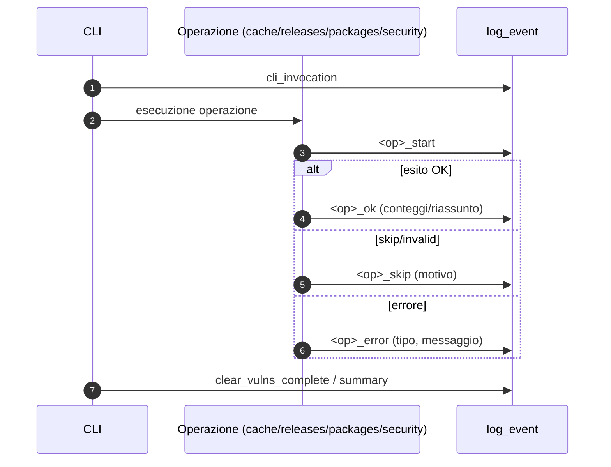
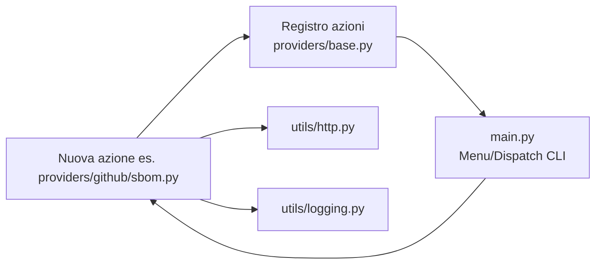
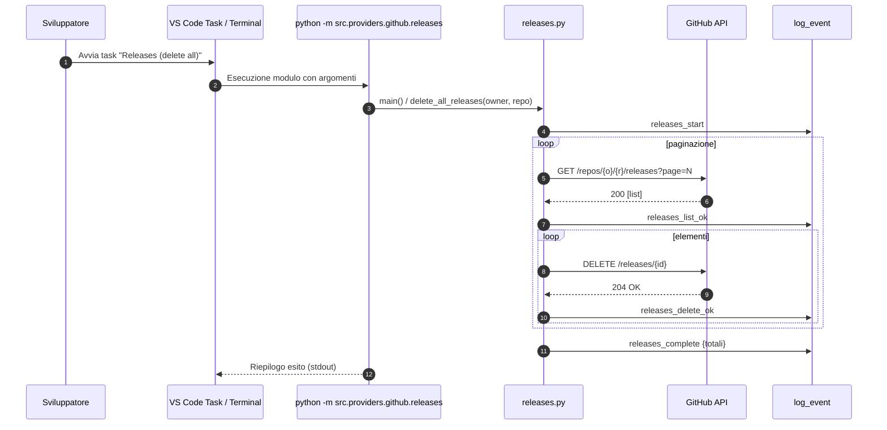

# Architettura & Componenti

Questo documento descrive l’architettura logica del progetto, i principali componenti applicativi, i flussi operativi (incluso Code Scanning), la gestione del rate‑limit GitHub, il modello di logging strutturato e come estendere il sistema con nuovi provider/azioni.

---

## Panoramica componenti

- `src/main.py`: **entrypoint CLI** multi‑provider e subcomandi (menu interattivo, `social-sync`, mapping operazioni).
- `src/providers/base.py`: interfaccia `Provider` e **registro** delle azioni eseguibili.
- `src/providers/github/`:
  - `cache.py`, `releases.py`, `packages.py`: operazioni CRUD su **Actions cache**, **Releases**, **Packages**.
  - `security.py`: **Code Scanning** (analyses/alerts) con gestione **rate‑limit** e flusso `delete`/`dismiss`.
  - `actions.py`: **registra** azioni provider (es. “Pulizia workflow runs (COMPLETED)”).
  - `social.py`: **social‑sync** followers/following (allowlist/blocklist, report).
  - `api.py`: helper **HTTP**, **paginazione**, **DELETE** e prompt owner/repo (se flusso interattivo).
- `src/utils/`:
  - `http.py`: costanti (`GITHUB_API`) e **wrapper HTTP** (intestazioni, versione API).
  - `logging.py`: logging **strutturato** (JSON/plain), `log_event`, `get_logger`, setup CLI.
  - `config.py`: caricamento **configurazioni** (env/CLI), in particolare per social‑sync.

### Diagramma componenti (alto livello)



---

## Flussi principali

### 1) Code Scanning — `delete analyses`

**Obiettivo**: eliminare analyses per i tool selezionati (es. Trivy, Grype), dal più recente a ritroso, seguendo eventuali **follow‑up** (`confirm_delete_url` / `next_analysis_url`) fino a **204**.



**Note operative**:

- Se `confirm_delete_url`/`next_analysis_url` è presente, il client segue finché non riceve **204** o la coppia è `null`.
- `confirm_delete=true` è aggiunto quando mancante.
- **Rate‑limit** gestito a livello `_request` (vedi sezione dedicata).

---

### 2) Code Scanning — `dismiss alerts`

**Obiettivo**: eseguire **dismiss** delle alert in `state=open` (default), con `reason` e `comment`, filtrando opzionalmente per **tool**.



**Reason valide**: `false_positive` | `won't_fix` | `used_in_tests`.

---

## Gestione rate‑limit GitHub

L’HTTP client usa `_request()` che intercetta gli header **`X-RateLimit-Remaining`** e **`X-RateLimit-Reset`** (oltre a un fallback su risposta **403** con “rate limit” nel body). Se necessario, **attende** fino al reset e **ritenta una volta**.

```mermaid
flowchart TD
  A[HTTP request] --> B{X-RateLimit-Remaining <= 0?}
  B -- No --> C[Return response]
  B -- Yes --> D{X-RateLimit-Reset presente?}
  D -- Yes --> E[Calcola wait_seconds = reset-now+1]
  D -- No --> F[wait_seconds = 30s di fallback]
  E --> G[Sleep(wait_seconds)]
  F --> G
  G --> H[Riprova la stessa request UNA volta]
  H --> I[Return response finale]
```

**Dettagli**:

- Se la risposta è **403** e il body contiene “rate limit”, il client usa `X-RateLimit-Reset` se presente o un **fallback** di 30s.
- L’evento `rate_limit_wait` è loggato con i **secondi di attesa**.

---

## Logging strutturato

Il sistema usa `src/utils/logging.py` con:

- `setup_logging(...)`: configurazione (console JSON/plain, livelli)
- `get_logger(__name__)`
- `log_event(logger, event_name, payload, level=...)` per **eventi strutturati** (chiavi coerenti)

**Principi**:

- **Mai** loggare **segreti** (PAT, credenziali, PII).
- Eventi standard per ogni operazione: `*_start`, `*_ok`, `*_skip`, `*_error`, `rate_limit_wait`, `cli_invocation`, `cli_error`.
- In modalità CLI, i **log** possono essere attivati/disattivati in base al contesto (interattivo vs diretto).



---

## Sicurezza

- Il **token** non viene **mai** serializzato nei log o incluso in eccezioni.
- **Reason** per `dismiss` sono **validate** (`false_positive`, `won't_fix`, `used_in_tests`).
- **Validazioni tipologiche**: ogni `resp.json()` è verificato (`isinstance(list/dict)`) e i valori sono castati solo dopo i controlli.
- Per elementi **malformati**: lo stream viene **skippato**, con evento `*_skip`.

---

## Estendibilità

Aggiungere **nuovi provider** o **nuove azioni** segue un pattern semplice:

1.  **Crea** una classe provider che implementa/estende l’interfaccia in `providers/base.py`.
2.  **Registra** le azioni nel provider (es. in `actions.py` o direttamente nel costruttore).
3.  **Esponi** entrypoint CLI (modulo Python o subcomando in `main.py`).
4.  **Usa** `utils/http.py` per coerenza degli header e delle versioni API.
5.  **Emetti** eventi coerenti via `utils/logging.py` (`log_event`).

### Diagramma di estensione (nuova azione provider)



**Checklist**:

- Tipizza in modo completo (mypy/Pylance **strict**).
- Gestisci **paginazione** e **rate‑limit** ove applicabile.
- **Non** loggare segreti; mantieni i payload multipli minimalisti.
- Aggiungi **task VS Code**/launch se utile e **documenta** in `docs/cli.md`.

---

## Sequenza end‑to‑end (esempio: “Elimina Releases”)



---

## Note di design

- **Separazione delle responsabilità**:
  - `main.py` orchestration/CLI
  - `providers/*` **business logic** per forgi specifici
  - `utils/*` **infrastruttura condivisa** (HTTP/log/config)
- **Resilienza**: stream di item (analyses/alerts/releases/caches) **tollerano** elementi malformati con `skip`, lasciando traccia nel log.
- **Idempotenza**: le operazioni sono progettate per essere ri‑eseguite in sicurezza (per quanto possibile), con indicatori chiari nel log.
- **Configurabilità**: via ENV/CLI; **VS Code tasks** e **CI** riflettono gli stessi gate (formattazione, lint, tipi, test, sicurezza).

---

### Collegamenti utili

- **Guida CLI**: `docs/cli.md`
- **CI / Quality Gate**: `docs/ci.md`
- **VS Code**: `docs/vscode.md`
- **Pre‑commit hooks**: `docs/pre-commit.md`
- **Setup & Ambienti**: `docs/setup.md`
- **Troubleshooting**: `docs/troubleshooting.md`

---
